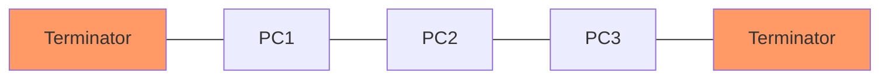

---
tags:
  - networking/topology
  - legacy
created: 2025-12-10
check: verified
---

# Bus and Ring Topologies (Legacy)

### 1. Bus Topology
**Structure:** A single, unbroken cable (the **Backbone**) with two terminated ends. All nodes connect to this backbone using T-connectors.
*   **Terminators:** Required at both ends to stop the signal from bouncing back (reflection).
![[BUS Topology Diagram.jpg]]
**Pros/Cons:**
*   ( + ) Cheap and easy for very small networks.
*   ( - ) **Data Collision:** All computers see all data; high traffic kills performance.
*   ( - ) **The Breakage Risk:** If the *Backbone cable* breaks, the **entire** network goes down.



### 2. Ring Topology

**Structure:** Each computer is connected directly to two others, forming a circle.
![[Ring Topology Diagram.png]]
- **Data Flow:** Traffic typically moves in one direction (unidirectional) to avoid collisions.
    

**Pros/Cons:**

- ( + ) **Predictable:** No collisions, equal access for all devices.
    
- ( - ) **Fragile:** If one computer/cable fails, the loop is broken, and the network stops.
    
- ( - ) **Hard to Scale:** To add a new device, you must physically break the ring to insert it.
    

codeMermaid

```
graph TD
    PC1 --- PC2
    PC2 --- PC3
    PC3 --- PC4
    PC4 --- PC1
```

