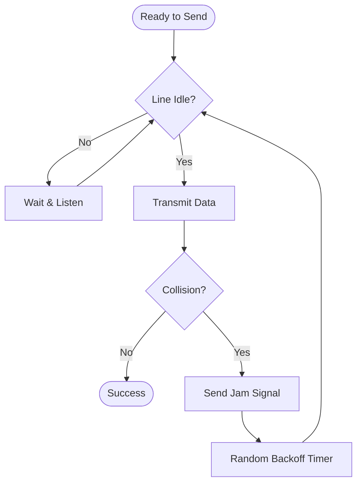

---
tags:
  - networking/layer2
  - protocols
created: 2025-12-23
check: enriched
---

# CSMA Media Access Control

**CSMA (Carrier Sense Multiple Access)** is the "Traffic Rulebook" for sharing a network cable or wireless frequency.

### 1. CSMA/CD (Collision Detection) - Wired
*   **Context:** Used in **Half-Duplex Ethernet** (Hubs). Obsolete in modern Switched networks.
*   **Logic:** "Listen. If quiet, speak. If interrupted, stop and wait."
*   **The Jam Signal:** If a collision is detected, the device screams a "Jam Signal" so everyone else stops too.

### 2. CSMA/CA (Collision Avoidance) - Wireless

- **Context:** Used in **Wi-Fi (802.11)**.
    
- **Why?** Wireless radios cannot transmit and listen at the same time (Half-Duplex), so they can't "detect" a collision while it happens. They must "avoid" it.
    
- **Logic:** "Listen. If quiet, ask permission (RTS). Wait for permission (CTS). Then speak."
    
- **RTS/CTS:** Request to Send / Clear to Send. This solves the **Hidden Node Problem**.
    

|                |                                   |                                            |
| -------------- | --------------------------------- | ------------------------------------------ |
| Feature        | CSMA/CD (Wired)                   | CSMA/CA (Wireless)                         |
| **Action**     | Detects collision, then recovers. | Tries to prevent collision before sending. |
| **Efficiency** | Faster (in low traffic).          | Slower (overhead of RTS/CTS).              |