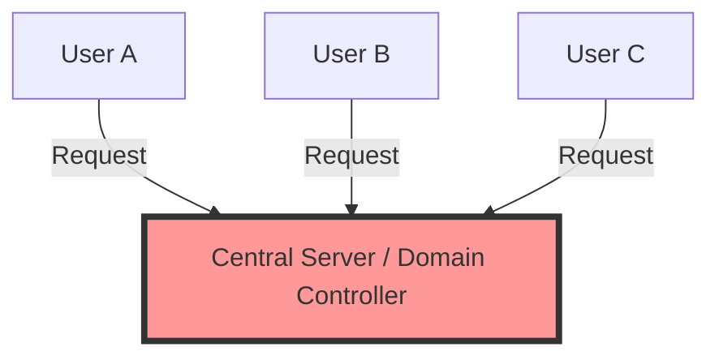

---
tags:
  - networking/architecture
  - security/risk
  - devops/admin
created: 2025-12-10
---
# Client-Server Architecture

**Definition:** A centralized model where specific nodes (Servers) provide services and manage security for requesting nodes (Clients).

### Key Characteristics
1.  **Centralized Administration:** The server holds all usernames, passwords, and Access Control Lists (ACLs).
2.  **High Admin Scalability:** Adding a user happens once on the server (e.g., Active Directory), and they immediately have access to the network based on their policy.
3.  **Simplified Policy Management:** Policies are enforced globally.

> [!danger] The "Single Point of Failure" Risk
> While management is easier, the centralization creates a high-value target.
> *   **SPOF:** If the main server goes down, no one can log in.
> *   **Total Compromise:** If an attacker gains admin access to the server, they have "persistence" and access to **every node** in the network.

### Visual Representation

Related:
[[Peer-to-Peer Architecture]][1][3][4][8][10][11]
[[Server Roles]]