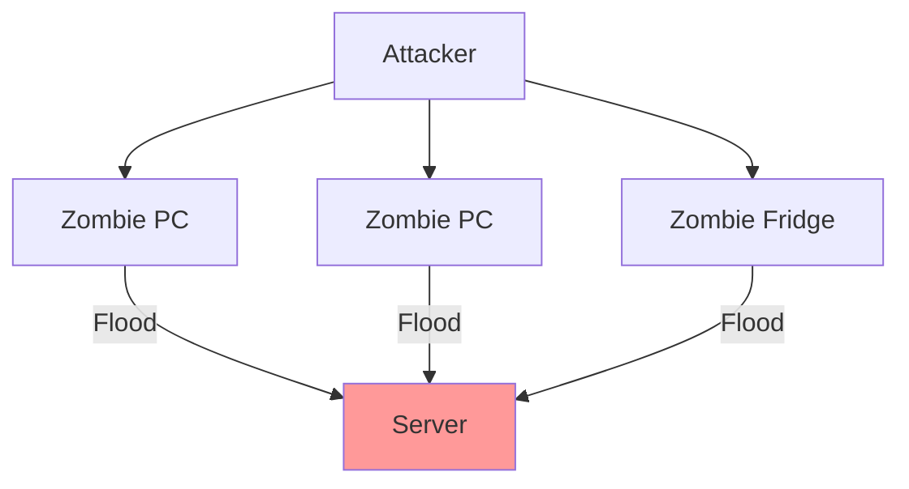

---
tags:
  - security/attacks
  - availability
created: 2025-12-27
check: verified
---

# Denial of Service (DoS/DDoS)

Attacks targeting the **Availability** of a system.

### 1. DoS (Denial of Service)
*   **Mechanism:** One attacker sends a flood of data to one victim.
*   **Goal:** Crash the server or consume 100% of the bandwidth so legitimate users can't get in.
*   **Limitation:** Easy to block (just block the one attacker's IP).

### 2. DDoS (Distributed Denial of Service)
*   **Mechanism:** One attacker controls a **Botnet** (thousands of infected "Zombie" computers) to attack one victim simultaneously.
*   **Goal:** Overwhelming force.
*   **Difficulty:** Very hard to stop because the traffic comes from everywhere (Grandma's laptop, smart fridges, etc.).

Related:
[[Network Traffic Types]]
