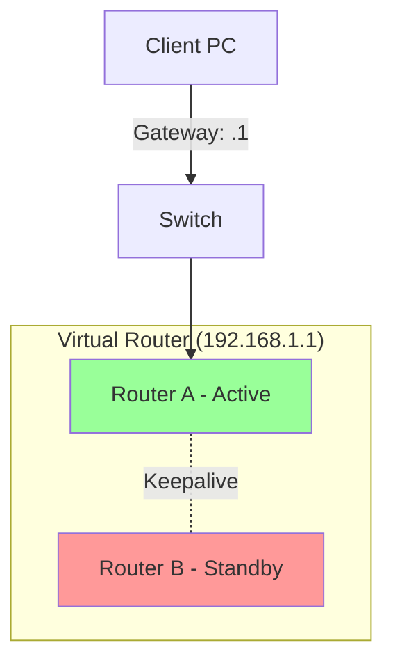

---
tags:
  - networking/redundancy
  - protocols
created: 2025-12-23
check: verified
---

# High Availability (Gateway Redundancy)

What happens if your Default Gateway (Router) dies? The internet cuts out.
**First Hop Redundancy Protocols (FHRP)** create a "Virtual Router" so users never notice a failure.

### The Protocols
| Protocol | Full Name | Vendor | Features |
| :--- | :--- | :--- | :--- |
| **HSRP** | Hot Standby Router Protocol | **Cisco** | Active/Standby. One router works, one sleeps. |
| **VRRP** | Virtual Router Redundancy Protocol | **Open Standard** | Active/Standby. Works on any brand. |
| **GLBP** | Gateway Load Balancing Protocol | **Cisco** | Active/Active. **Both** routers work and share traffic. |

