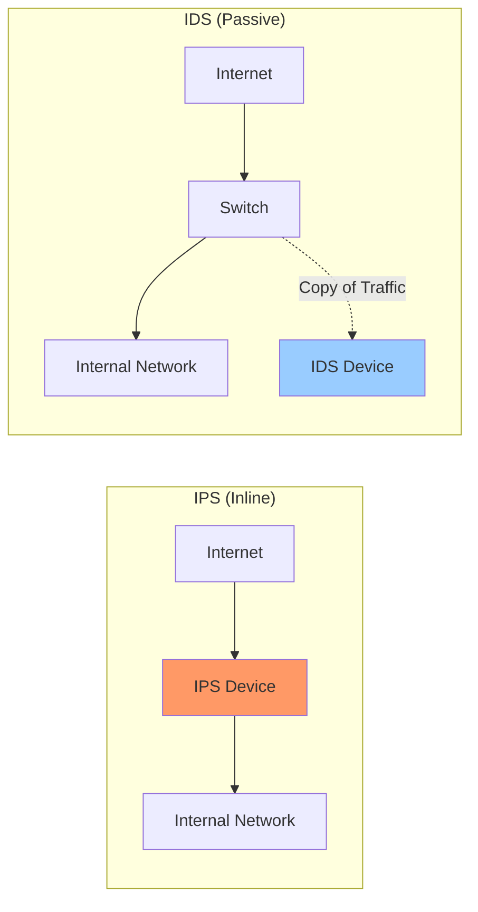

---
tags:
  - networking/security
  - defense
created: 2025-12-22
check: enriched
---

# IDS vs. IPS

Systems designed to catch hackers. They use **Signatures** (database of known attacks) or **Heuristics** (behavioral anomalies).
![[IDS-IPS-graphic.webp]]
### 1. IDS (Intrusion Detection System)
*   **Role:** The "Burglar Alarm."
*   **Placement:** Connected via a "Tap" or "Port Mirror" (SPAC). It sits **Out-of-Band** (on the side).
*   **Action:** If it sees an attack, it logs it and sends an **Alert**. It **cannot** stop the packet because the packet has already passed through.
*   **Risk:** False Positives (Annoying alerts).

### 2. IPS (Intrusion Prevention System)
*   **Role:** The "Security Guard."
*   **Placement:** Connected **In-Line** (Traffic flows *through* it).
*   **Action:** If it sees an attack, it **BLOCKS** it immediately.
*   **Risk:** False Positives (It might block legitimate traffic, causing an outage).

