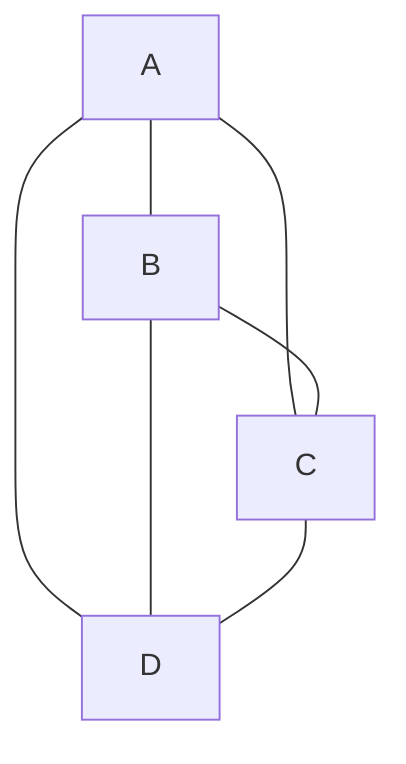

---
tags:
  - networking/topology
  - redundancy
created: 2025-12-10
check: verified
---

# Mesh and Hybrid Topologies

### 1. Mesh Topology
**Structure:** Devices are connected to multiple other devices to provide redundancy.
*   **Full Mesh:** Every device connects to every other device.
*   **Partial Mesh:** Some devices connect to all, others only to a few.
![[mesh-topology-2.webp]]
**Why use it?**
*   **High Reliability:** If one path fails, data reroutes instantly.
*   **Cost:** Very expensive (cabling and ports). Used mostly in **WANs** or core infrastructure, not for office desks.

### 2. Hybrid Topology

**Structure:** A combination of two or more topologies (e.g., a Star network connected to a Ring backbone).
![[Hybrid Topology Diagram.png]]
- **Pros:** Flexible and scalable.
    
- **Cons:** Complex maintenance and high cost.