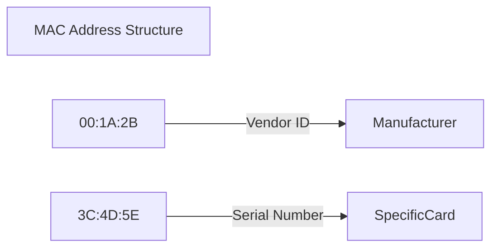

---
tags:
  - networking/layer1
  - networking/layer2
  - hardware
created: 2025-12-25
check: verified
---

# NIC and MAC Addresses

### NIC (Network Interface Card)
The hardware component (Physical Layer) that connects a device to the network medium (Cable or Wireless).
*   **Speed:** 10/100/1000 Mbps (Gigabit) or 10Gbps.
*   **Role:** Converts digital computer data (binary) into electrical/light/radio signals.

### MAC Address (Media Access Control)
The "Physical Address" burned into the NIC.
*   **Format:** 48-bit Hexadecimal (e.g., `00:1A:2B:3C:4D:5E`).
*   **Structure:**
    *   **First 24 bits (OUI):** Organizationally Unique Identifier (Identifies the Manufacturer, e.g., Dell, Apple).
    *   **Last 24 bits:** Device ID (Unique Serial Number).
*   **Permanence:** The **BIA (Burned In Address)** is permanent, but software can "Spoof" (fake) a different MAC for privacy or hacking.

**Related:**

- [[Address Resolution Protocol (ARP)]] (Maps IP to MAC)