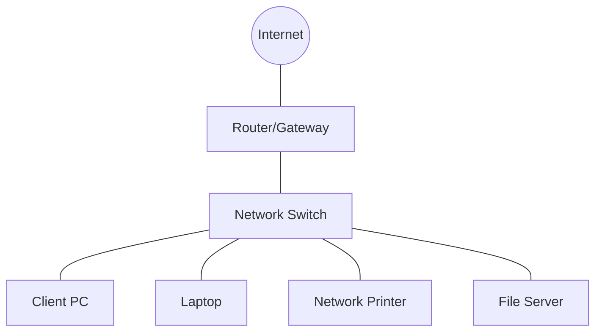

---
tags:
  - networking/basics
  - definitions
created: 2025-12-10
---

# Network Definition & Nodes

A **Network** is a system of interconnected devices (nodes) involved in the exchange of data and sharing of resources.

**Goal:** To allow devices to communicate and share resources (files, printers, internet access).

### Visualizing a Simple Network

**Related:**

- [[Network Host Types]]
    
- [[Network Geographic Types]]