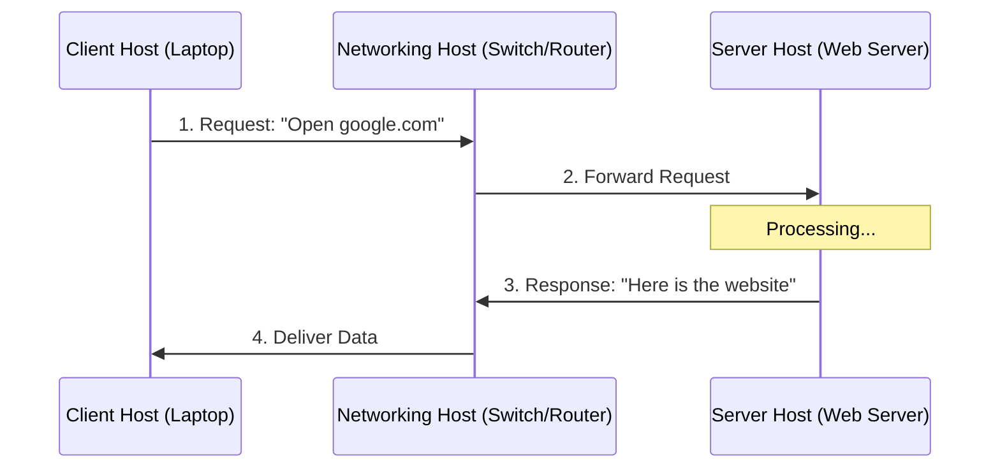

---
tags:
  - networking/hardware
  - definitions
created: 2025-12-10
---

# Network Host Types

A **Host** is any device on a network that possesses an **IP address** and is capable of sending or receiving data.

### The Three Main Classifications

1. **Client Host:** Requests services (e.g., Laptop, Smartphone).
2. **Server Host:** Provides services (e.g., Web Server). See [[Server Roles]].
3. **Networking Host:** Connects the others (Intermediaries like Routers/Switches).

### Interaction Flow

**Related:**

- [[Virtualization Basics]]