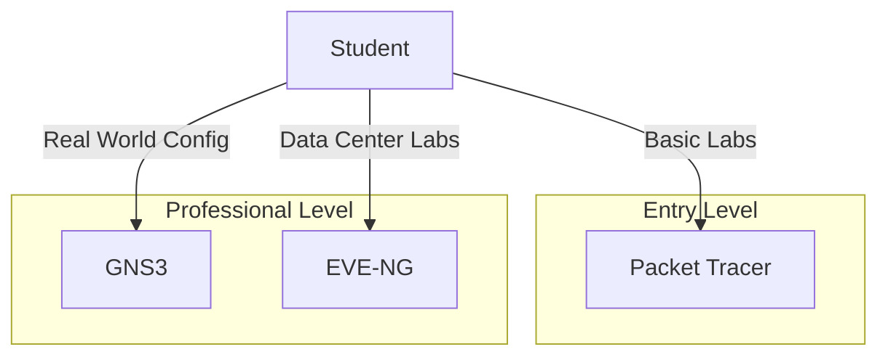

---
tags:
  - networking/tools
  - labs
  - virtualization
created: 2025-12-27
check: enriched
---

# Network Lab Tools

To learn networking, you need to build labs. There are three main tools, split into two categories: **Simulators** and **Emulators**.

### 1. Cisco Packet Tracer (The Simulator)
*   **Definition:** A visual simulation tool designed by Cisco for the **CCNA** exam.
*   **How it works:** It does **not** run real operating systems. It runs a piece of software that "pretends" to be a router.
*   **Pros:** Lightweight (runs on any laptop), free, easy to use, visually shows packets moving.
*   **Cons:** **Limited commands.** If a command isn't in the exams, it likely won't work in Packet Tracer. You cannot use it for advanced non-Cisco networks.

### 2. GNS3 (Graphical Network Simulator-3)
*   **Definition:** A network **Emulator**. It virtualizes real hardware.
*   **How it works:** It runs the **Real IOS images** (binary files). If you run a router in GNS3, it is actually running the real operating system.
*   **Pros:** **100% accurate behavior.** Supports Cisco, Juniper, Arista, Docker, and Linux.
*   **Cons:** **Resource Heavy.** You need a powerful PC (lots of RAM/CPU) because you are running 10+ virtual machines. You also need to legally obtain the IOS images yourself.

### 3. EVE-NG (Emulated Virtual Environment - Next Gen)
*   **Definition:** "The other big one." An enterprise-grade, clientless **Emulator**.
*   **How it works:** You install EVE-NG on a Server or a VM, and you access it via a **Web Browser**.
*   **Pros:** Clientless (HTML5), massive scalability, supports almost every vendor (Palo Alto, Fortinet, Cisco). Standard for **CCIE** and professional engineering.
*   **Cons:** Harder to set up initially. Requires dedicated resources (VMware Workstation or a Bare Metal server).

### Comparison: Simulation vs. Emulation

| Feature | Packet Tracer (Simulator) | GNS3 / EVE-NG (Emulator) |
| :--- | :--- | :--- |
| **Realism** | Low (Mimics behavior) | High (Runs actual OS) |
| **Resources** | Low (Runs on anything) | High (Needs RAM/CPU) |
| **Vendor Support** | Cisco Only | Multi-Vendor (Cisco, Juniper, Linux...) |
| **Best For** | Beginners / CCNA Students | Professionals / CCNP / CCIE |

Related:
[[Virtualization Basics]]