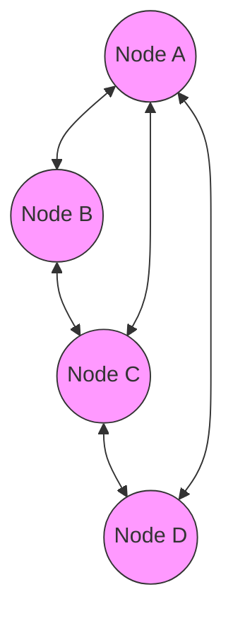

---
tags:
  - networking/architecture
  - security/access-control
created: 2025-12-10
---
---
# Peer-to-Peer (P2P) Architecture

**Definition:** A decentralized network model where each node functions simultaneously as both a **client** and a **server**.
![[Peer-to-Peer Diagram.png]]
### Key Characteristics
1.  **Decentralized Administration:** Each node configures its own resources and security.
    *   *Example:* Node A must manually configure that Node B has "Full Access" but Node C only has "Read Access."
2.  **No Centralized ACL:** There is no single database of users.
    *   *Nuance:* Local ACLs still exist on each machine (e.g., Windows SAM database), but they do not sync with other nodes.
3.  **Poor Admin Scalability:** Managing policies is difficult. If a new user joins, every existing node must be updated individually to grant them access.

> [!warning] Security Risk
> Because policies must be enforced node-by-node, it is very easy to have **inconsistent security configurations**, leaving gaps for attackers.

### Visual Representation

**Related:**

- [[Client-Server Architecture]]