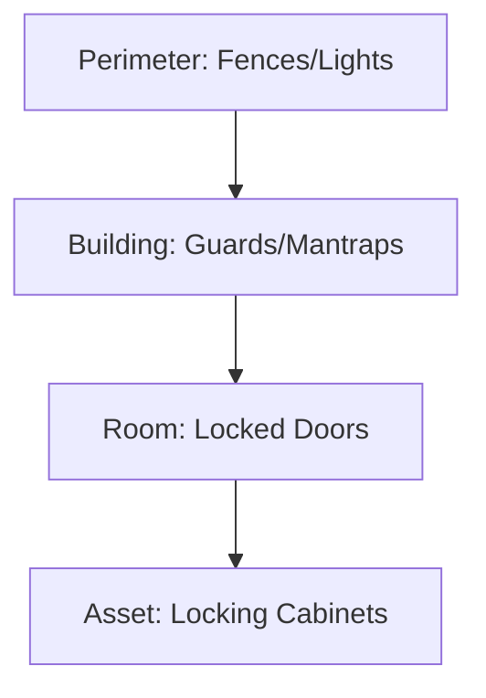

---
tags:
  - security/physical
  - defense-in-depth
created: 2025-12-27
check: verified
---

# Physical Security Layers

**Definition:** The protection of personnel, hardware, software, network, and data from physical actions and events.
*   **Concept:** **Defense in Depth**. If one layer fails (Gate), the next layer (Door) should stop the intruder.

### The 4 Layers of Defense

1.  **Perimeter (Outer Layer):**
    *   *Goal:* Deterrence. Keep people off the property.
    *   *Controls:* Fencing (min 8ft), Lighting (motion-activated), Signage ("No Trespassing"), Bollards (stops cars).
2.  **Building (Access Control Layer):**
    *   *Goal:* Verification. Ensure only staff enters.
    *   *Controls:* Guards, Smart Card readers, Biometrics, Mantraps.
3.  **Room (Inner Layer):**
    *   *Goal:* Authorization. Ensure staff only enter *their* area.
    *   *Controls:* Server Room locked doors, Internal partitions.
4.  **Asset (Deep Layer):**
    *   *Goal:* Prevention. Even if they get in the room, they can't take the drive.
    *   *Controls:* Locked Server Racks (Cages), USB Locks, Screen Filters.

**Related:**

- [[Physical Access Control Methods]]