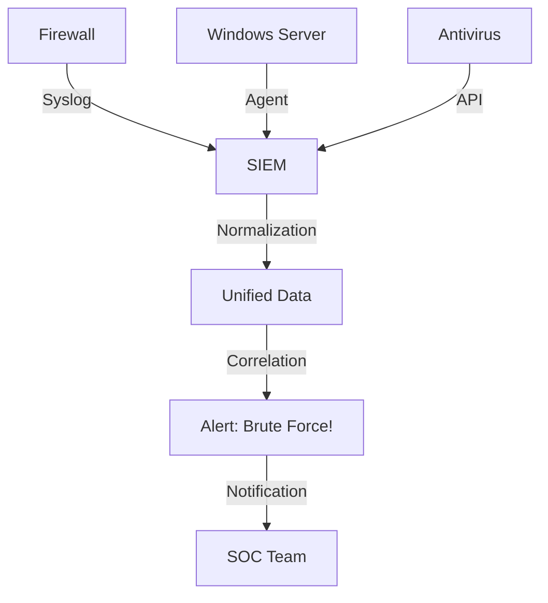

---
tags:
  - security/siem
  - detection
  - soc
created: 2025-12-28
check: verified
---

# SIEM Fundamentals

**Definition:** Security Information and Event Management (SIEM) is the "Brain" of a Security Operations Center (SOC). It combines two functions:
1.  **SIM (Information Management):** Long-term storage and collection of logs (for compliance).
2.  **SEM (Event Management):** Real-time monitoring and alerting of threats.

### The Problem it Solves
A Firewall sees packets. An Antivirus sees files. A Server sees logins.
*   *Without SIEM:* These three devices don't talk to each other.
*   *With SIEM:* It correlates data: "The Firewall blocked an IP, and 5 seconds later, that same IP tried to log into the Server." -> **ALERT!**

### Core Components
1.  **Log Collection (Ingestion):** Pulling data via Syslog, API, or Agents.
2.  **Normalization:** Converting "EventID 4625" (Windows) and "auth_fail" (Linux) into one standard name: `Login_Failure`.
3.  **Correlation Engine:** The logic. "If X happens 5 times in 1 minute, trigger Y."
4.  **Dashboards:** Visual graphs for the SOC Analysts.

Related:
[[Syslog for Network Monitoring]]
[[IDS and IPS Systems]]
