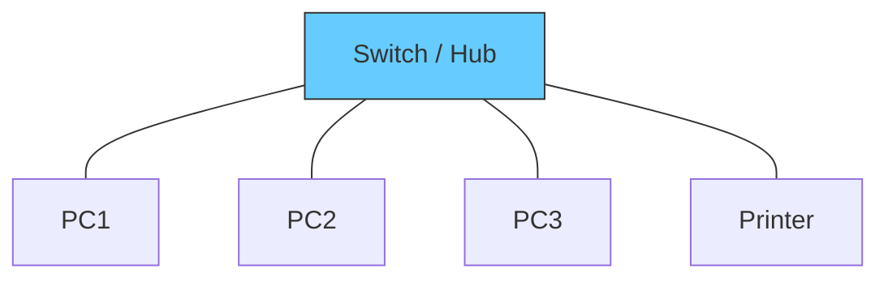

---
tags:
  - networking/topology
  - standard
created: 2025-12-10
check: verified
---

# Star Topology

**The Gold Standard.** All devices connect to a central device (Switch, Hub, or Access Point) via individual cables.
![[star_topology.webp]]
### Hub vs. Switch
*   **Hub:** "Dumb" device. Repeats incoming data to *all* ports.
*   **Switch:** "Smart" device. Reads the destination address and sends data *only* to that specific device.

### Pros & Cons
| Feature | Impact |
| :--- | :--- |
| **Fault Tolerance** | ✅ High. If one cable breaks, only that one PC is affected. |
| **Scalability** | ✅ Easy. Just plug a new cable into the switch. |
| **Troubleshooting** | ✅ Centralized management makes it easy to find faults. |
| **Single Point of Failure** | ❌ If the Central Switch dies, everyone disconnects. (See [[High Availability (HA)]]). |

