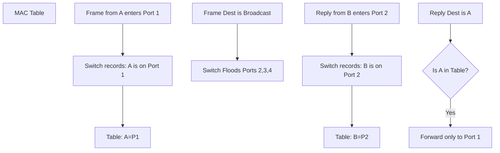

---
tags:
  - cisco/switching
  - layer2
  - logic
created: 2026-01-01
check: enriched
---

# Switching Logic and MAC Learning

A switch has one job: Forward frames to the correct port. It does this using the **MAC Address Table** (CAM Table).

### The 3 Rules of Switching
1.  **Learn:** If a frame enters a port, the Switch records the **Source MAC** and the **Port Number** in its table. ("I now know PC A is on Port 1").
2.  **Flood:** If the Destination MAC is **Unknown** OR **Broadcast** (`FF:FF...`), the switch sends the frame out **ALL** ports (except the one it came in on).
3.  **Forward:** If the Destination MAC is **Known** (in the table), the switch unicasts the frame *only* to that specific port.

### The ARP Scenario (Detailed)
*Goal: PC A wants to Ping PC B. PC A broadcasts an ARP Request.*

1.  **Ingress:** ARP Request arrives at Switch Port 1.
    *   *Action:* Switch learns **PC A MAC = Port 1**.
2.  **Decision:** Switch sees Dest MAC is `FFFF.FFFF.FFFF`.
    *   *Action:* **Flood** out Ports 2, 3, 4.
3.  **Reply:** PC B receives the ARP. Sends ARP Reply (Unicast) back to PC A.
4.  **Ingress:** ARP Reply arrives at Switch Port 2.
    *   *Action:* Switch learns **PC B MAC = Port 2**.
5.  **Decision:** Switch sees Dest MAC is PC A. It checks the table.
    *   *Action:* Table says "Port 1". Switch **Forwards** directly to Port 1.

