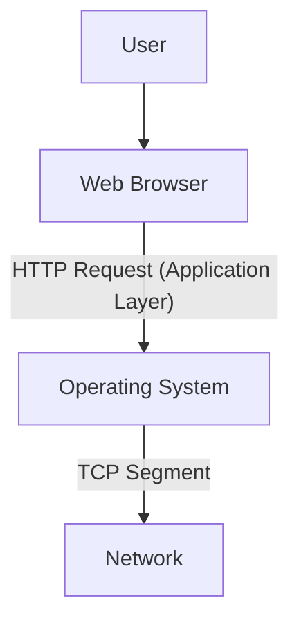

---
tags:
  - networking/tcp-ip
  - application
  - protocols
created: 2025-12-14
check: verified
---

# TCP/IP Application Layer

**Definition:** The top layer of the TCP/IP model. It acts as the interface between the software running on the computer and the network itself.

### The "Super Layer" Concept
Unlike the OSI model, the TCP/IP Application layer combines three OSI layers into one:
*   **OSI Layer 5 (Session):** Managing the dialog.
*   **OSI Layer 6 (Presentation):** Encryption and formatting.
*   **OSI Layer 7 (Application):** User interface.

### Key Protocols & Services
This layer contains the "Languages" that applications speak.

| Protocol | Function |
| :--- | :--- |
| **HTTP / HTTPS** | Transferring web pages and resources. |
| **SMTP** | Sending email between servers. |
| **POP3 / IMAP** | Retrieving email from a server to a client. |
| **DNS** | Resolving Domain Names (google.com) to IP addresses. |
| **FTP** | File Transfer Protocol. |

Related:
[[OSI Upper Layers]]