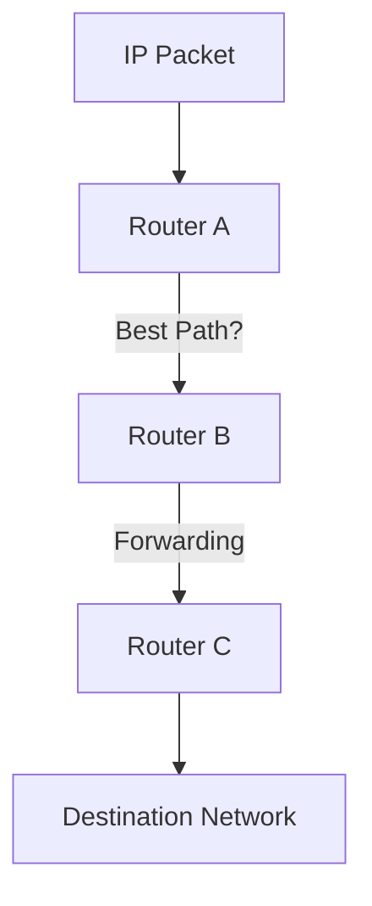

---
tags:
  - networking/tcp-ip
  - routing
created: 2025-12-13
check: verified
---

# TCP/IP Internet Layer

**Definition:** This layer moves data **between networks**. It doesn't care about the cable type; it cares about the logical address (IP).
*   *Maps to OSI Layer 3 (Network).*
![[tcpip model layers.jpg]]
### Core Functions
1.  **Logical Addressing:** Assigning unique IP addresses (IPv4 / IPv6) to hosts.
2.  **Routing:** Determining the best path to a destination.
3.  **Packet Forwarding:** Passing the data from Router A to Router B until it reaches the destination.

### Key Protocols
*   **IP (Internet Protocol):** The envelope that carries the data. Connectionless and "Best Effort."
*   **ICMP (Internet Control Message Protocol):** The diagnostic tool. Used for `ping` and `traceroute` to report errors (e.g., "Destination Unreachable").
*   **BGP (Border Gateway Protocol):** The "GPS of the Internet." It decides routing paths between major ISPs and organizations.
    *   *Note:* While BGP controls this layer, it technically runs on top of TCP.

Related:
[[Transport Layer and TCP]] (The layer above)