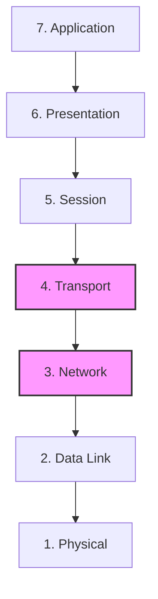

---
tags:
  - networking/osi
  - definitions
created: 2025-12-10
check: verified
---

# The OSI Model Framework

**Definition:** The Open Systems Interconnection (OSI) model is a conceptual framework that standardizes the functions of a telecommunication or computing system into 7 distinct layers.
![[OSI Model.webp]]
### Why do we use it?
1.  **Troubleshooting:** It allows engineers to isolate issues (e.g., "Is this a Layer 1 cable issue or a Layer 7 application issue?").
2.  **Vendor Interoperability:** Ensures that a Network Card from Vendor A works with a Switch from Vendor B.
3.  **Modular Development:** Developers can write code for the Application Layer without worrying about how the Physical Layer transmits bits (Abstraction).

### The 7 Layers & Data Units (PDU)
A critical concept is the **Protocol Data Unit (PDU)**. As data moves down, it gets "encapsulated."

| # | Layer | PDU Name | Key Function |
| :--- | :--- | :--- | :--- |
| **7** | **Application** | Data | User Interface / APIs |
| **6** | **Presentation** | Data | Encryption / Formatting |
| **5** | **Session** | Data | Dialog Control |
| **4** | **Transport** | **Segment** | End-to-End Reliability (TCP/UDP) |
| **3** | **Network** | **Packet** | Routing & Logical Addressing (IP) |
| **2** | **Data Link** | **Frame** | Physical Addressing (MAC) |
| **1** | **Physical** | **Bit** | Cables, Voltage, Light |

**Related:**

- [[OSI Upper Layers]] (7, 6, 5)
    
- [[Transport Layer and TCP]] (Layer 4)