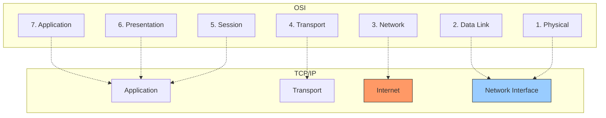

---
tags:
  - networking/models
  - tcp-ip
  - definitions
created: 2025-12-13
check: verified
---

# The TCP/IP Model

**Definition:** The practical, real-world model used for the Internet (Dept of Defense Model). It condenses the theoretical 7 OSI layers into 4 (or sometimes 5) practical layers.
![[working of TCPIP model.webp]]
### OSI vs. TCP/IP Mapping

| OSI Layer | TCP/IP Layer (4-Layer Ver) | Function |
| :--- | :--- | :--- |
| Application (7)   Presentation (6)   Session (5) | **Application** | Services, Encoding, Dialog |
| Transport (4) | **Transport** | Reliability & Flow Control |
| Network (3) | **Internet** | IP Addressing & Routing |
| Data Link (2)   Physical (1) | **Network Interface** | Physical transmission & MAC framing |

![[Layer of TCPIP model.webp]]
### Goal
*   **Reliability:** ensuring data survives path failures.
*   **Routability:** moving data across different network types (Ethernet to Wi-Fi to Fiber).

Related:
[[The OSI Model Framework]]
[[TCP-IP Internet Layer]]