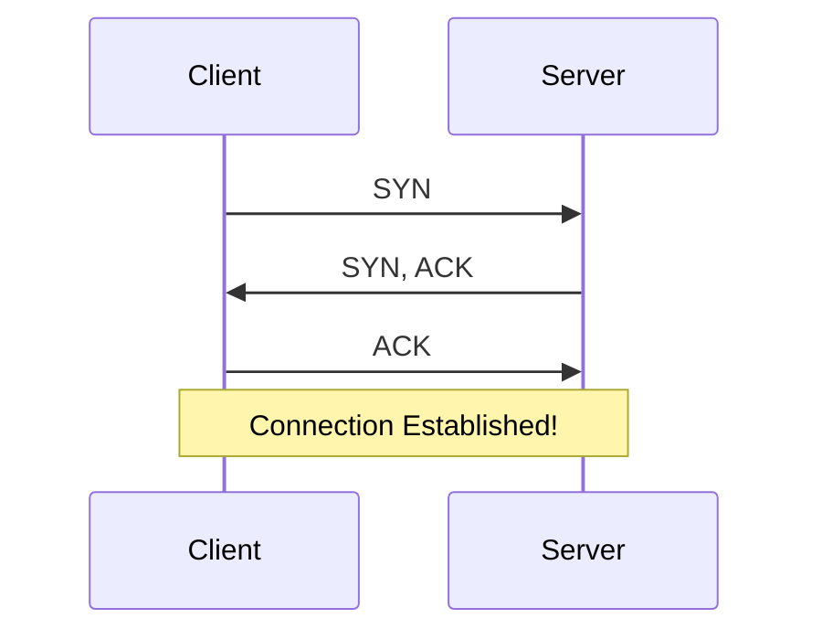

---
tags:
  - networking/osi
  - tcp-ip
  - reliability
created: 2025-12-10
check: enriched
---

# Transport Layer (Layer 4)

**Role:** Responsible for the logical connection between the source and destination. It decides **how** data is sent (Reliable vs. Fast).
![[Transport Layer Working Diagram.jpg]]
### TCP vs. UDP

| Feature | TCP (Transmission Control Protocol) | UDP (User Datagram Protocol) |
| :--- | :--- | :--- |
| **Type** | Connection-Oriented | Connection-less |
| **Reliability** | Reliable (Guaranteed delivery) | Unreliable (Best effort) |
| **Ordering** | Sequenced (1, 2, 3...) | Unordered |
| **Flow Control** | **Yes** | **No** (Fire and forget) |
| **Use Case** | Web (HTTP), Email (SMTP) | Streaming, VoIP, Gaming |

### The TCP 3-Way Handshake
Before sending data, TCP creates a session.
1.  **SYN:** "Hello, I want to talk."
2.  **SYN/ACK:** "I hear you, and I want to talk too."
3.  **ACK:** "Okay, connection established."

### TCP Features (How it ensures reliability)

**1. Flow Control (Windowing)**

- Concept: Prevents the sender from overwhelming the receiver.
    
- **Sliding Window:** The receiver tells the sender, "I can handle 3 packets right now." The sender sends 3. If the receiver processes them quickly, it increases the window size ("Send me 5 now!").
    
- Note: UDP cannot do this. If a UDP receiver is overwhelmed, it drops packets.
    

**2. Acknowledgments (ACKs)**

- TCP uses **Positive Acknowledgment with Retransmission**.
    
- Scenario: Sender sends Packet 1, 2, 3, 4, 5.
    
- Error: Packet 5 is lost.
    
- Recovery: Receiver sends "ACK 5" (meaning: "I have up to 4, I am waiting for 5"). Sender re-sends Packet 5.