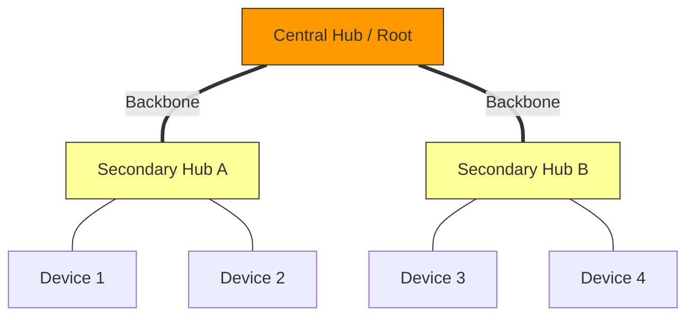

---
tags:
  - networking/topology
  - hierarchical
created: 2025-12-10
check: verified
---

# Tree Topology

**Definition:** A hierarchical structure often described as a "Star of Stars." It connects multiple Star networks via a main backbone cable to a Root Node (Central Hub).
![[tree_topology.webp]]
### Structure & Data Flow
*   **Hierarchy:** Data flows from Top (Root) -> Secondary Hub -> Device.
*   **The "Repeater" Effect:** Because it uses active hubs/switches at each node, the signal is regenerated, allowing the network to cover longer distances than a standard Star or Bus.
*   **Protocols:** Often used with **DHCP** and automatic configuration (SAC) because the hierarchy makes it easy to segment the network into branches (subnets).

### Pros & Cons
| Feature | Details |
| :--- | :--- |
| **Scalability** | ✅ Excellent. You can add new "branches" (Secondary Hubs) without disturbing the root. |
| **Signal Range** | ✅ Increases the distance a signal can travel (due to regeneration). |
| **Fault Tolerance** | ⚠️ **Partial.** If a *Device* fails, it's fine. If a *Secondary Hub* fails, that branch dies. |
| **Root Failure** | ❌ **Critical.** If the Central Root hub fails, the entire network crashes (Non-robust). |
| **Complexity** | ❌ Difficult to configure and wire compared to a simple Star. |

### Visual Representation

**Related:**

- [[Star Topology]] (The building block of a Tree)
    
- [[Bus and Ring Topologies]] (The backbone often acts like a Bus)