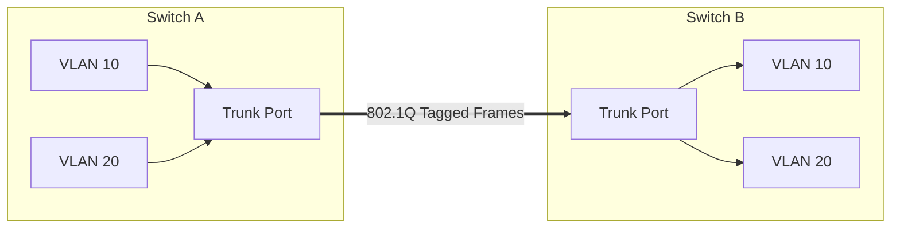

---
tags:
  - cisco/vlan
  - trunking
  - protocols
created: 2026-01-02
check: enriched
---

# Trunking and 802.1Q

**Trunk Port:** A port that carries traffic for **multiple** VLANs.
*   **Use Case:** Connecting Switch-to-Switch or Switch-to-Router.
*   **Analogy:** An Access Port is a single letter. A Trunk Port is a mail truck carrying bags of letters for different cities.

### The Protocol: 802.1Q ("Dot1Q")
How does Switch B know a frame belongs to VLAN 10? Switch A **Tags** it.
*   **Tagging:** 802.1Q inserts a **4-Byte Tag** into the Ethernet Header.
*   **Native VLAN:** The *one* VLAN that is **NOT** tagged on a trunk (Default: VLAN 1). Both switches must match Native VLANs or you get errors.

### Configuration
```cli
Switch(config)# interface gi0/1
Switch(config-if)# switchport mode trunk
! (Optional) Restrict allowed VLANs
Switch(config-if)# switchport trunk allowed vlan 10,20,30
```

### Verification

- show interfaces trunk: Shows which ports are trunks and which VLANs are allowed.


