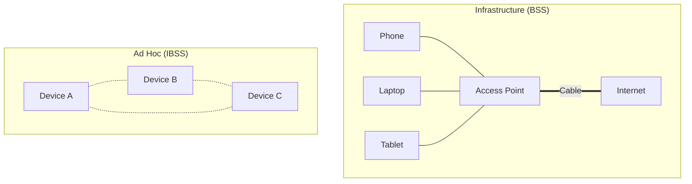

---
tags:
  - networking/wireless
  - topology
created: 2025-12-10
check: enriched
---

# Wireless Topologies

Wireless networks define how devices connect without cables. There are two primary modes of operation.

### 1. Ad Hoc Mode (IBSS)
**Definition:** Independent Basic Service Set. Devices communicate **directly** with each other without a central Access Point (AP).![[Ad Hoc Diagram.png]]
*   **Structure:** Decentralized (Peer-to-Peer). Each device is sender and receiver.
*   **Deployment:**
    *   **Fast:** No hardware installation required. Perfect for disaster recovery, Airdrop, or temporary meetings.
    *   **Performance:** Degrades quickly as more devices join (due to data collisions).
*   **Security:**
    *   **Low Security:** Hard to manage. No centralized authentication.
    *   **Risk:** If one device is compromised, it can attack others directly. Mutual trust is assumed.

### 2. Infrastructure Mode (BSS)
**Definition:** Basic Service Set. Devices connect to a **Central Access Point (AP)**, which acts as a bridge to the wired network (DS).![[Infrastructure Wireless Topology Diagram.png]]
*   **Structure:** Centralized (Star topology).
*   **Features:**
    *   **DHCP:** The network can automatically assign IPs to prevent conflicts.
    *   **Roaming:** You can move between different APs (ESS) without losing connection.
*   **Security:**
    *   **High Security:** Can use **WPA3-Enterprise** (802.1X) to require usernames/passwords.
    *   **Control:** Admins can blacklist devices, filter traffic, and monitor logs centrally.

### Visual Comparison

**Related:**

- [[802.11 Wireless Standards]]
    
- [[Peer-to-Peer Architecture]]